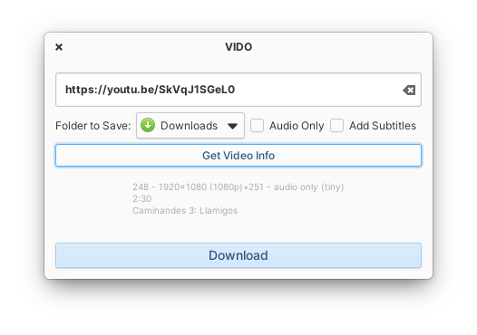

# VIDO
**A GTK3 Video Downloader**

Download online videos from various sources including archive.org and much more!

[](https://appcenter.elementary.io/com.github.bernardodsanderson.vido)



## Dependencies

Please make sure you have these dependencies first before building.

```
granite
gtk+-3.0
libhandy-1
```

To build locally:

`flatpak-builder build com.github.bernardodsanderson.vido.yml --user --install --force-clean`
